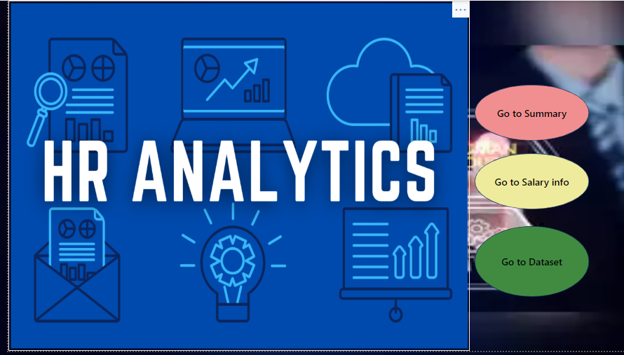
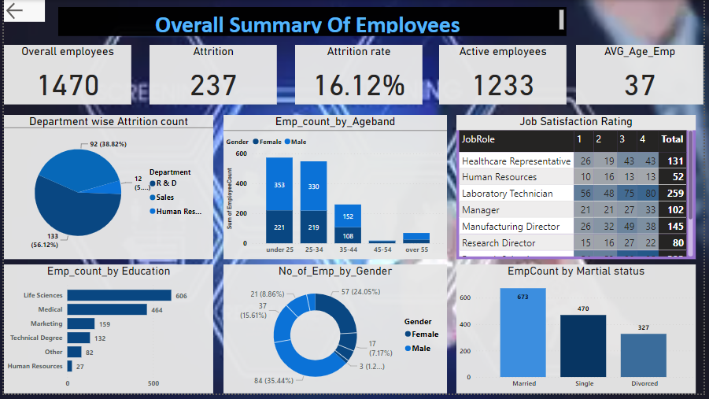

# HR_Analysis_Report

---

## **Introduction**

This is a Power bi project on **HR dataset**.
This project is to analyze and derive insights to answer crucial questions and help the Manager to make decisions and maintain a healthy environment in a Company.  

**_Disclaimer_** : _I took the HR dataset from Kaggale website For  Power bi analysis_

## **About dataset**

HR Analytics helps us with interpreting organizational data. It finds the people-related trends in the data and allows the HR Department to take the appropriate steps to keep the organization running smoothly and profitably. Attrition in a corporate setup is one of the complex challenges that the managers and the HRs personnel have to deal with.

## **Problem statement**

1.What is the Count of Employees?

2.What is the Average age of Employees in a company?

3.What is the Attrition Count?

4.How many employees are currently working?

5.Who are the Top 15 employees by Salary wise?

6.What is count of employees by Age ?

## Concepts demonstrated :

The following power bi concepts are used.

-DAX

-Filters

-New measure

-conditional column

-custom column

-Page navigation

-Buttons

## Visualization

The Report consists of 4 pages :

1. Home_page

2. Summary

3. Salary_info

**Feratures** :

-Home page contain 3 buttons,first button take us to corresponding website where i get the dataset and other ones navigate to pages with similar names.

**Summary of Employees in Company** :

-The company hired total 1470 employees out of 1233 employees are currently working remaining 237 employees are left the company.

-The company has Higher number of male employees than Female employees.

-Surprisingly Life science students got hired more with 606 number.

**Salary information** :

